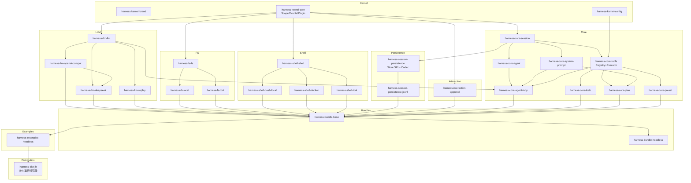

# 02 · 模块布局（JPMS）

## 1. 模块命名约定

| 层级 | 命名模式 | 示例 |
|---|---|---|
| Kernel | `io.javanatic.harness.kernel[.<sub>]` | `io.javanatic.harness.kernel`（core）、`…kernel.brand` |
| Core | `io.javanatic.harness.core.<pkg>` | `io.javanatic.harness.core.session` |
| Capability | `io.javanatic.harness.<cap>[.<pkg>]` | `io.javanatic.harness.fs`, `io.javanatic.harness.fs.local` |
| Bundle | `io.javanatic.harness.bundle.<name>` | `io.javanatic.harness.bundle.base` |
| Examples | `io.javanatic.harness.examples.<name>` | `io.javanatic.harness.examples.headless` |
| Distribution | 无 JPMS 模块（jlink 编排 POM）| `harness-dist-jh` |

JPMS 模块名用完整 `io.javanatic.harness.*`（**无缩写**，包名与模块名一致，import 即模块名前缀）。Maven coordinates 用 `io.github.retreatisadvance:harness-<group>-<pkg>:<version>`，artifactId 全程小写连字符（如 `harness-kernel-core`）。**groupId 与包名不同源属有意为之**：groupId 是中央仓命名空间（GitHub 身份 `io.github.retreatisadvance`，随注册主体可变），包名 / JPMS 名是编译期身份（改名成本高，不动）。

## 2. 完整模块清单

### Kernel 层（框架内核，零业务依赖）

| 模块 | JPMS 名 | 依赖 | 职责 |
|---|---|---|---|
| `harness-kernel-brand` | `…kernel.brand` | （无）| `Id<T>` phantom type（对应 dsh-brand）|
| `harness-kernel-core` | `…kernel` | （无，仅 java.base）| `Scope`/`Runtime`/`ServiceKey`/`Disposable`（.scope）、`Events`/`EventKey`/监听器（.events）、`Plugin`/`PluginLoader`（.plugin）—— 统一内核（[01](01-kernel.md)）|
| `harness-kernel-config` | `…kernel.config` | （无）| YAML 解析（白名单）+ `ConfigService`（[07 §4](07-profile-bundle.md)）|

> **为什么 kernel 从 8 个模块收敛到 3 个**：`Scope` 的方法签名同时引用 Events（订阅视图）与 Plugin（装载），按 fiber/context/scope/events/plugin 拆模块必然互 `requires` 成环。统一内核把三套 Cordis 概念（Fiber/ScopeKey/Context）合成一个 `Scope` 后，循环消失，单模块 + 多导出包即可（[01 §1](01-kernel.md)）。`brand` 与 `config` 因零依赖独立，供最小心智单元引用。
>
> **没有 aggregate jar**：JPMS 的 `requires` 本就可传递；消费者按需 `requires io.javanatic.harness.kernel`（必要时另加 brand/config），不再提供 re-export 聚合模块，也不使用 `requires transitive` 传染依赖。

### Core 层（Agent 主干）

| 模块 | 依赖 | 职责 | dsh 对应 |
|---|---|---|---|
| `harness-core-session` | `kernel` | `Session`（事件日志 + `LoggedEvent` 信封）、核心事件类型、消息模型（`Message`/`ContentBlock`）、`SurfaceManager` 投影、`SessionStore` 接口。**零 Jackson 依赖**（codec 在持久化 seam）| `core/session` |
| `harness-core-system-prompt` | `kernel`, `session` | `SystemPromptService` 组装注册表 | `core/system-prompt` |
| `harness-core-tools` | `kernel`, `session`, `llm.llm` | `ToolRegistry`（注册 + schemas）与 `ToolExecutor`（R2 单一分发 pipeline）**同模块分接口**；`ApprovalService` Definition + auto 内置 provider；**首个 Jackson 边界**（ToolArgs 校验模型 tool JSON，08 §6）（[05 §8](05-capability-seam.md)）| `core/tools` |
| `harness-core-agent` | `kernel`, `session` | `Agent` 接口、`AgentRegistry`（ScopedValue initiator）、`AgentHandle` | `core/agent` |
| `harness-core-agent-loop` | `agent`, `tools`, `system-prompt`, `llm` | `AgentLoopImpl` 驱动（Turn/Step 状态机）| `core/agent-loop` |
| `harness-core-todo` | `kernel`, `kernel.config`, `session`, `tools`, `session.persistence` | `todo_write` 工具 + `todo/write` 扩展事件：整表快照落账、回放末值胜；codec 经 ServiceLoader 双注册 | `todo/tool-todo` |
| `harness-core-plan` | `kernel`, `kernel.config`, `session`, `tools`, `system-prompt`, `session.persistence` | 计划模式：`plan/mode` 扩展事件 fold（末值胜）+ `plan:policy` 提示段 + `exit_plan_mode` 工具 | `plan/plan-mode` |
| `harness-core-preset` | `kernel`, `kernel.config`, `tools`, `llm.llm` | per-session agent 能力集：`preset.yml` 行在 setup window 内挂载到 agent scope（[06 §6](06-scope.md)）；SnakeYAML 第四边界 | `preset/agent-presets` |
| `harness-core` | 上述全部 | 聚合（packaging=pom 的 reactor 聚合，无 JPMS re-export）| `core` |

### Capability 层（可替换 seam）

每个 seam 是 **Definition + Provider(s) + Consumer** 三个模块（[05](05-capability-seam.md)）：

#### LLM（模型适配器）

| 模块 | 角色 | 职责 |
|---|---|---|
| `harness-llm-llm` | Definition | `LlmService`（`Stream<StreamChunk> stream(...)` 阻塞式）、`StreamChunk` 类型。`Message`/`ContentBlock` 在 `core/session`（消息是被日志的事实；dsh 靠 TS type-only import 从 llm 借用，Java 的 `requires` 是真实模块边，依赖方向要求消息模型在被日志的一侧）|
| `harness-llm-openai-compat` | Provider | 通用 OpenAI 兼容适配器（插件 id `llm-openai-compat`）：传输韧性（重试/退避/空闲看门狗/有界队列背压）+ wire 构造/防御性 SSE 解码；厂商差异收敛为 `VendorProfile`（[05](05-capability-seam.md)）|
| `harness-llm-deepseek` | Provider | DeepSeek 薄壳：`DeepSeekOptions` + 默认画像（id `llm-deepseek`，程序化组合用）；wire 与传输韧性在 `llm/openai-compat` |
| `harness-llm-replay` | Provider | 回放适配器（插件 id `llm-replay`，keyless 测试依赖它）|

#### FS（文件系统）

| 模块 | 角色 | 职责 |
|---|---|---|
| `harness-fs-fs` | Definition | `FsService` 接口（read/write/edit/delete/list/search）|
| `harness-fs-local` | Provider | 本地文件系统实现（插件 id `fs-local`）|
| `harness-fs-tool` | Consumer | `fs_read`/`fs_write`/`fs_edit`/`fs_delete`/`fs_list`/`fs_search` 工具 |

#### Shell（命令执行）

| 模块 | 角色 | 职责 |
|---|---|---|
| `harness-shell-shell` | Definition | `ShellExecutor` 接口（request/result 分离，逐调用携带 `SandboxPolicy`）|
| `harness-shell-bash-local` | Provider | 本地 bash 实现（插件 id `shell-bash-local`）；受限档经 `SandboxProvider.confine` 包装 argv |
| `harness-shell-docker` | Provider | docker 容器实现（插件 id `shell-docker`，it12.5）——环境级隔离，**挂载面即可写面**（容器根恒只读）；与 bash-local 互斥，换 Provider 不动 seam |
| `harness-shell-tool` | Consumer | `bash` 工具 |

#### Sandbox（沙箱）

| 模块 | 角色 | 职责 |
|---|---|---|
| `harness-sandbox-sandbox` | Definition | 模式词表/逐调用 Policy/confine 包装/WritableRoots 单一来源（[05 §6](05-capability-seam.md)，it12 落定）|
| `harness-sandbox-local` | Provider | 平台链 darwin=[seatbelt]、linux=[bwrap]（it12.7 落定）、win32=空链（windows-acl 入 0.2.0）|
| `harness-sandbox-policy` | Provider | 逐调用策略解析：部署默认档 + plan/mode fold 压只读 |

#### Session Persistence（会话持久化）

| 模块 | 角色 | 职责 |
|---|---|---|
| `harness-session-persistence` | Definition | `SessionStore` SPI + **`SessionEventCodec`**（序列化归 seam；domain record 零 Jackson 注解，[03 §6](03-session-event-sourcing.md)）|
| `harness-session-persistence-jsonl` | Provider | JSONL 后端（插件 id `persistence-jsonl`）；Jackson 边界之一（另有 core-tools、llm/openai-compat）|

> MVP 只做 JSONL，不做 SQLite。接口预留。

#### Interaction（交互/审批）

| 模块 | 角色 | 职责 |
|---|---|---|
| `harness-interaction-approval` | Definition + 默认 Provider | `ApprovalService`（`Mode.AUTO/HUMAN_GATE/DENY_ALL`）+ 三个默认实现插件 `approval-auto`/`approval-ask`/`approval-deny`（**真实非 stub**，[05 §6](05-capability-seam.md)；实现演进独立时再拆模块）|
| `harness-interaction-commands` | Definition | `CommandRegistry`（slash 命令；register 即 effect、重复名 fail loud）+ `parseCommand` + `command/run`/`command/done` 事件对（it14 实装，[05 §9](05-capability-seam.md)）|

### Bundle 层（组合发行）

| 模块 | 职责 | dsh 对应 |
|---|---|---|
| `harness-bundle-base` | 首层 bundle：挂载 model adapter + tools + persistence + sandbox + approval | `dsh-base` |
| `harness-bundle-headless` | 一次性 runner（无 server） | `dsh-headless` |

### Examples（可运行示例）

| 模块 | 职责 |
|---|---|
| `harness-examples-agent-spine` | 最小 agent 主干 demo（6 包 loop 跑通）|
| `harness-examples-headless` | `jh` 命令行 runner（CLI 完备：`--help`/`--workspace=`/`--approval=`…，`--verify` 也在此，R4；裸 `jh` 进 REPL——斜杠命令面 + 流式渲染，it14）；经 `dist/jh` 打成 jlink 运行时镜像 |

### Distribution 层（运行产物，it13；归档 it16）

| 模块 | 职责 |
|---|---|
| `harness-dist-jh` | jlink 运行时镜像编排：聚合 `harness-examples-headless` 及其模块图，产出 `dist/jh/target/jlink-image/bin/jh`（解出即用，无手拼 module-path）；同相位以 assembly 归档为 `javanatic-harness-<版本>-<平台>.tar.gz/.zip`（平台标记按 os family profile 注入，zip-6 压缩）。无运行时代码、无 JPMS 模块；`packaging=jar` 仅为满足 moditect 插件对主产物的入口前提（空 jar 不进镜像）。插件面由显式 jlink 根清单覆盖（无 jmods 的 JDK 拒 `--bind-services`；缺根漂移由镜像内 `--verify` 兜底）|

## 3. 依赖图



Jackson 只出现在 `core-tools`、`llm/openai-compat` 与 `persistence-jsonl` 三个边界模块（model/tool JSON、wire JSON、codec JSON）；`core-session` 及全部 domain 模块零 Jackson。

## 4. module-info.java 示例

### kernel.core（统一内核）

```java
// 仅依赖 java.base（concurrent 集合都在 java.base 里）；brand/config 是同层独立模块，
// kernel/core 不使用它们——依赖图里没有这条边，谁用谁 requires
module io.javanatic.harness.kernel {
    exports io.javanatic.harness.kernel.scope;   // Scope, Runtime, ServiceKey, Disposable, Effect
    exports io.javanatic.harness.kernel.events;  // Events, EventKey, 监听器, WaterfallArgs, Next
    exports io.javanatic.harness.kernel.plugin;  // Plugin, PluginLoader
}
```

### core.session（无 Jackson —— codec 在持久化 seam）

```java
module io.javanatic.harness.core.session {
    requires io.javanatic.harness.kernel;
    requires io.javanatic.harness.kernel.brand;   // Id<SessionId.Brand>

    exports io.javanatic.harness.core.session;
    exports io.javanatic.harness.core.session.event;
    exports io.javanatic.harness.core.session.surface;
    // 测试与主类同包，JUnit 反射实例化需要运行时开放；domain record 仍零注解、无反射序列化
    opens io.javanatic.harness.session;
}
```

### session.persistence-jsonl（Jackson 边界之一：JSONL codec）

```java
module io.javanatic.harness.session.persistence.jsonl {
    requires io.javanatic.harness.kernel;
    requires io.javanatic.harness.kernel.config;
    requires io.javanatic.harness.kernel.brand;
    requires io.javanatic.harness.core.session;
    requires io.javanatic.harness.session.persistence;   // SessionEventCodec SPI
    requires com.fasterxml.jackson.databind;
    // 扩展事件 codec 由各事件模块 provides，本后端发起发现（provides/uses 成对）
    uses io.javanatic.harness.session.persistence.SessionEventCodec;

    provides io.javanatic.harness.kernel.plugin.Plugin
        with io.javanatic.harness.session.persistence.jsonl.JsonlPersistencePlugin;

    exports io.javanatic.harness.session.persistence.jsonl;
}
```

### llm.deepseek（Provider，薄壳）

```java
module io.javanatic.harness.llm.deepseek {
    requires io.javanatic.harness.kernel;
    requires io.javanatic.harness.llm.llm;
    requires io.javanatic.harness.llm.openai.compat;   // wire/韧性在通用适配器
    requires jdk.httpserver;                           // 测试：经 seam 的假服务端冒烟

    exports io.javanatic.harness.llm.deepseek;
}
```

### bundle.base

```java
module io.javanatic.harness.bundle.base {
    requires io.javanatic.harness.kernel;
    requires io.javanatic.harness.kernel.config;
    requires io.javanatic.harness.core.session;
    requires io.javanatic.harness.core.tools;
    requires io.javanatic.harness.sandbox.sandbox;
    requires io.javanatic.harness.core.agent.loop;
    requires io.javanatic.harness.session.persistence;
    requires org.yaml.snakeyaml;

    // bundle 不 export API 之外的东西；AppBoot 入口导出
    exports io.javanatic.harness.boot;
}
```

插件面（llm/fs/shell/todo/plan/approval/commands 等）经 bundle.yml 行 + ServiceLoader 发现装配，bundle 模块本身不 `requires` 各 Provider。

## 5. Maven 构建结构

多模块 Maven reactor。父 POM 集中声明版本、插件配置；每个子模块一个最小 `pom.xml`。

### 为什么 Maven 而非 Gradle

| 维度 | Maven | Gradle |
|---|---|---|
| JPMS 支持 | compiler 3.10+ 原生识别 `module-info.java` | 需 `modularity.inferModulePath=true`，部分场景需 extra 插件 |
| 多模块依赖图可读性 | `dependency:tree` + 父 POM `dependencyManagement` 直观 | `dependencies` task，配置更灵活但也更隐晦 |
| IDE 支持 | IntelliJ/Eclipse/VSCode 一等公民，零配置导入 | 需 Gradle 插件，首次导入慢 |
| 企业 CI 兼容 | 几乎所有 CI 模板默认 Maven | 需额外 wrapper 配置 |
| 本项目需求 | 多模块 + JPMS + SPI，Maven 完全够用 | 增量编译/构建缓存对本项目收益有限 |

本项目模块多但每模块小、依赖关系清晰、无复杂构建逻辑（无 codegen、无多产物变体），Maven 的声明式 POM + 父子继承最匹配。

### 目录布局

```
harness/
├── pom.xml                          ← 父 POM（packaging=pom，聚合 + 公共配置）
├── kernel/
│   ├── pom.xml                      ← 聚合（packaging=pom，列 <modules>）
│   ├── brand/pom.xml                ← Id<T>
│   ├── core/pom.xml                 ← Scope/Events/Plugin（io.javanatic.harness.kernel）
│   └── config/pom.xml               ← ConfigService + YAML
├── core/
│   ├── pom.xml                      ← 聚合
│   ├── session/pom.xml
│   ├── system-prompt/pom.xml
│   ├── tools/pom.xml                ← ToolRegistry + ToolExecutor
│   ├── agent/pom.xml
│   ├── agent-loop/pom.xml
│   ├── todo/pom.xml                 ← todo_write 工具 + todo/write 事件
│   ├── plan/pom.xml                 ← 计划模式（plan/mode + exit_plan_mode）
│   └── preset/pom.xml               ← per-session 能力集（setup window 挂载）
├── llm/
│   ├── pom.xml                      ← 聚合
│   ├── llm/pom.xml
│   ├── openai-compat/pom.xml        ← 通用 OpenAI 兼容适配器（wire/韧性/VendorProfile）
│   ├── deepseek/pom.xml
│   └── replay/pom.xml
├── fs/
│   ├── pom.xml
│   ├── fs/pom.xml
│   ├── local/pom.xml
│   └── tool/pom.xml
├── shell/…
├── sandbox/…
├── session/
│   ├── pom.xml
│   ├── persistence/pom.xml          ← SessionStore SPI + SessionEventCodec
│   └── persistence-jsonl/pom.xml
├── interaction/
│   ├── pom.xml
│   ├── approval/pom.xml
│   └── commands/pom.xml
├── bundle/
│   ├── pom.xml
│   ├── base/pom.xml
│   └── headless/pom.xml
├── examples/
│   ├── pom.xml
│   ├── agent-spine/pom.xml
│   └── headless/pom.xml
└── dist/
    ├── pom.xml                      ← 聚合
    └── jh/pom.xml                   ← jlink 运行时镜像编排（无代码；产出 target/jlink-image/bin/jh 与 tar.gz/zip 归档）
```

### 父 POM（根 `harness/pom.xml`）

```xml
<?xml version="1.0" encoding="UTF-8"?>
<project xmlns="http://maven.apache.org/POM/4.0.0"
         xmlns:xsi="http://www.w3.org/2001/XMLSchema-instance"
         xsi:schemaLocation="http://maven.apache.org/POM/4.0.0
                             https://maven.apache.org/xsd/maven-4.0.0.xsd">
    <modelVersion>4.0.0</modelVersion>

    <groupId>io.github.retreatisadvance</groupId>
    <artifactId>harness-parent</artifactId>
    <version>0.2.0-SNAPSHOT</version>
    <packaging>pom</packaging>

    <name>DeepSeek Harness (JH)</name>

    <properties>
        <maven.compiler.release>25</maven.compiler.release>
        <project.build.sourceEncoding>UTF-8</project.build.sourceEncoding>

        <!-- 用 BOM 集中管第三方版本，避免每个子模块散落版本号 -->
        <jackson.version>2.17.0</jackson.version>
        <snakeyaml.version>2.2</snakeyaml.version>
        <junit.version>5.10.2</junit.version>
        <assertj.version>3.25.3</assertj.version>
        <jqwik.version>1.8.5</jqwik.version>
        <jacoco.version>0.8.12</jacoco.version>
    </properties>

    <!-- 聚合：列出所有一级子聚合模块 -->
    <modules>
        <module>kernel</module>
        <module>core</module>
        <module>llm</module>
        <module>fs</module>
        <module>shell</module>
        <module>sandbox</module>
        <module>session</module>
        <module>interaction</module>
        <module>bundle</module>
        <module>examples</module>
        <module>dist</module>
    </modules>

    <dependencyManagement>
        <dependencies>
            <!-- 第三方 BOM -->
            <dependency>
                <groupId>com.fasterxml.jackson</groupId>
                <artifactId>jackson-bom</artifactId>
                <version>${jackson.version}</version>
                <type>pom</type>
                <scope>import</scope>
            </dependency>
            <dependency>
                <groupId>org.junit</groupId>
                <artifactId>junit-bom</artifactId>
                <version>${junit.version}</version>
                <type>pom</type>
                <scope>import</scope>
            </dependency>

            <!-- 第三方单 artifact -->
            <dependency>
                <groupId>org.yaml</groupId>
                <artifactId>snakeyaml</artifactId>
                <version>${snakeyaml.version}</version>
            </dependency>
            <dependency>
                <groupId>org.assertj</groupId>
                <artifactId>assertj-core</artifactId>
                <version>${assertj.version}</version>
                <scope>test</scope>
            </dependency>
            <dependency>
                <groupId>net.jqwik</groupId>
                <artifactId>jqwik</artifactId>
                <version>${jqwik.version}</version>
                <scope>test</scope>
            </dependency>

            <!-- 内部模块：在此集中声明 GAV，子模块引用时不写 version -->
            <dependency>
                <groupId>io.github.retreatisadvance</groupId>
                <artifactId>harness-kernel-brand</artifactId>
                <version>${project.version}</version>
            </dependency>
            <dependency>
                <groupId>io.github.retreatisadvance</groupId>
                <artifactId>harness-kernel-core</artifactId>
                <version>${project.version}</version>
            </dependency>
            <dependency>
                <groupId>io.github.retreatisadvance</groupId>
                <artifactId>harness-kernel-config</artifactId>
                <version>${project.version}</version>
            </dependency>
            <dependency>
                <groupId>io.github.retreatisadvance</groupId>
                <artifactId>harness-core-session</artifactId>
                <version>${project.version}</version>
            </dependency>
            <dependency>
                <groupId>io.github.retreatisadvance</groupId>
                <artifactId>harness-core-tools</artifactId>
                <version>${project.version}</version>
            </dependency>
            <dependency>
                <groupId>io.github.retreatisadvance</groupId>
                <artifactId>harness-core-agent</artifactId>
                <version>${project.version}</version>
            </dependency>
            <dependency>
                <groupId>io.github.retreatisadvance</groupId>
                <artifactId>harness-llm-llm</artifactId>
                <version>${project.version}</version>
            </dependency>
            <dependency>
                <groupId>io.github.retreatisadvance</groupId>
                <artifactId>harness-fs-fs</artifactId>
                <version>${project.version}</version>
            </dependency>
            <dependency>
                <groupId>io.github.retreatisadvance</groupId>
                <artifactId>harness-shell-shell</artifactId>
                <version>${project.version}</version>
            </dependency>
            <!-- ... 其余内部模块同理 ... -->
        </dependencies>
    </dependencyManagement>

    <build>
        <pluginManagement>
            <plugins>
                <plugin>
                    <artifactId>maven-compiler-plugin</artifactId>
                    <version>3.13.0</version>
                    <configuration>
                        <release>25</release>
                        <!--
                          JPMS：Maven 3.6+ + compiler 3.10+ 自动识别
                          src/main/java/module-info.java，把 module-path 设为所有 dependencies。

                          无 preview：全仓库不使用 --enable-preview（11 §5），
                          因此这里也没有 enablePreview 开关。
                        -->
                        <compilerArgs>
                            <arg>-Xlint:all</arg>
                            <arg>-Werror</arg>  <!-- 警告即错误，对应 dsh fail loud -->
                        </compilerArgs>
                    </configuration>
                </plugin>

                <plugin>
                    <artifactId>maven-surefire-plugin</artifactId>
                    <version>3.2.5</version>
                    <!-- JPMS 下测试也走 module-path；JUnit 反射实例化同包测试类所需的 opens
                         由各模块 module-info 自行声明（§4），无需 surefire argLine -->
                </plugin>

                <!-- 覆盖率（可选）-->
                <plugin>
                    <groupId>org.jacoco</groupId>
                    <artifactId>jacoco-maven-plugin</artifactId>
                    <version>${jacoco.version}</version>
                </plugin>
            </plugins>
        </pluginManagement>

        <!-- 所有子模块继承的测试依赖 -->
        <dependencies>
            <dependency>
                <groupId>org.junit.jupiter</groupId>
                <artifactId>junit-jupiter</artifactId>
                <scope>test</scope>
            </dependency>
            <dependency>
                <groupId>org.assertj</groupId>
                <artifactId>assertj-core</artifactId>
                <scope>test</scope>
            </dependency>
            <dependency>
                <groupId>net.jqwik</groupId>
                <artifactId>jqwik</artifactId>
                <scope>test</scope>
            </dependency>
        </dependencies>
    </build>
</project>
```

### 聚合 POM（如 `kernel/pom.xml`，packaging=pom）

```xml
<?xml version="1.0" encoding="UTF-8"?>
<project xmlns="http://maven.apache.org/POM/4.0.0"
         xmlns:xsi="http://www.w3.org/2001/XMLSchema-instance"
         xsi:schemaLocation="http://maven.apache.org/POM/4.0.0
                             https://maven.apache.org/xsd/maven-4.0.0.xsd">
    <modelVersion>4.0.0</modelVersion>

    <parent>
        <groupId>io.github.retreatisadvance</groupId>
        <artifactId>harness-parent</artifactId>
        <version>0.2.0-SNAPSHOT</version>
        <!-- parent 的 relativePath 默认指向上一级 -->
    </parent>

    <artifactId>harness-kernel-aggregator</artifactId>
    <packaging>pom</packaging>

    <modules>
        <module>brand</module>
        <module>core</module>
        <module>config</module>
    </modules>
</project>
```

### 叶子模块 POM（如 `kernel/core/pom.xml`）

kernel/core 零内部依赖，无 `<dependencies>` 段（测试依赖 junit/assertj/jqwik 由根 POM 统一注入）：

```xml
<?xml version="1.0" encoding="UTF-8"?>
<project xmlns="http://maven.apache.org/POM/4.0.0"
         xmlns:xsi="http://www.w3.org/2001/XMLSchema-instance"
         xsi:schemaLocation="http://maven.apache.org/POM/4.0.0
                             https://maven.apache.org/xsd/maven-4.0.0.xsd">
    <modelVersion>4.0.0</modelVersion>

    <parent>
        <groupId>io.github.retreatisadvance</groupId>
        <artifactId>harness-kernel-aggregator</artifactId>
        <version>0.2.0-SNAPSHOT</version>
    </parent>

    <artifactId>harness-kernel-core</artifactId>
</project>
```

### Provider 模块 POM（如 `llm/deepseek/pom.xml`）—— SPI 关键

```xml
<project>
    <parent>
        <groupId>io.github.retreatisadvance</groupId>
        <artifactId>harness-llm-aggregator</artifactId>
        <version>0.2.0-SNAPSHOT</version>
    </parent>

    <artifactId>harness-llm-deepseek</artifactId>

    <dependencies>
        <!-- 只依赖 Definition，不依赖其他 Provider -->
        <dependency>
            <groupId>io.github.retreatisadvance</groupId>
            <artifactId>harness-llm-llm</artifactId>
        </dependency>
        <dependency>
            <groupId>io.github.retreatisadvance</groupId>
            <artifactId>harness-kernel-core</artifactId>
        </dependency>
        <dependency>
            <groupId>io.github.retreatisadvance</groupId>
            <artifactId>harness-kernel-config</artifactId>
        </dependency>
    </dependencies>
</project>
```

### Consumer 模块 POM（如 `fs/tool/pom.xml`）—— 隔离关键

```xml
<project>
    <parent>
        <groupId>io.github.retreatisadvance</groupId>
        <artifactId>harness-fs-aggregator</artifactId>
        <version>0.2.0-SNAPSHOT</version>
    </parent>

    <artifactId>harness-fs-tool</artifactId>

    <dependencies>
        <!-- ✅ 只依赖 Definition + 工具注册表 -->
        <dependency>
            <groupId>io.github.retreatisadvance</groupId>
            <artifactId>harness-fs-fs</artifactId>
        </dependency>
        <dependency>
            <groupId>io.github.retreatisadvance</groupId>
            <artifactId>harness-core-tools</artifactId>
        </dependency>
        <!-- ❌ 注意：不依赖 harness-fs-local（Provider）！
                module-info.java 没有 requires，
                pom.xml 也没有 <dependency>。
                双重保障（JPMS 编译期 + Maven 依赖图）。-->
    </dependencies>
</project>
```

### headless 可执行 jar（`examples/headless/pom.xml`）

```xml
<project>
    <parent>
        <groupId>io.github.retreatisadvance</groupId>
        <artifactId>harness-examples-aggregator</artifactId>
        <version>0.2.0-SNAPSHOT</version>
    </parent>

    <artifactId>harness-examples-headless</artifactId>

    <dependencies>
        <dependency>
            <groupId>io.github.retreatisadvance</groupId>
            <artifactId>harness-bundle-base</artifactId>
        </dependency>
    </dependencies>

    <build>
        <finalName>jh</finalName>
        <plugins>
            <!-- 打可执行 fat jar：把所有 provider 一起打进 classpath -->
            <plugin>
                <artifactId>maven-shade-plugin</artifactId>
                <version>3.5.2</version>
                <executions>
                    <execution>
                        <phase>package</phase>
                        <goals><goal>shade</goal></goals>
                        <configuration>
                            <transformers>
                                <transformer implementation="org.apache.maven.plugins.shade.resource.ManifestResourceTransformer">
                                    <mainClass>io.javanatic.harness.headless.HeadlessMain</mainClass>
                                </transformer>
                                <!--
                                  合并所有 SPI 描述文件（ServiceLoader 发现关键）。
                                  shade 默认用 ServicesResourceTransformer 合并
                                  META-INF/services，但 JPMS 下 provider 声明在
                                  module-info.java 的 provides 里——shade 会处理。
                                -->
                                <transformer implementation="org.apache.maven.plugins.shade.resource.ServicesResourceTransformer"/>
                            </transformers>
                        </configuration>
                    </execution>
                </executions>
            </plugin>
        </plugins>
    </build>
</project>
```

### 常用命令

```sh
mvn clean install                  # 全量构建 + 安装到本地仓库
mvn -pl :harness-core-session test # 只测一个模块（按 artifactId 过滤）
mvn -pl :harness-examples-headless -am package  # 只打 headless 及其依赖
mvn dependency:tree                # 查看某模块的依赖树（验证 Consumer 未拉入 Provider）
java -jar examples/headless/target/jh.jar --profile headless --verify   # R4 治理断言，无 key 可跑
```

`-am`（also-make）会自动构建被依赖的模块；`-pl`（projects）按 `:artifactId` 选中。

## 6. dsh → JH 模块映射对照

| dsh 包 | JH 模块 | 状态 |
|---|---|---|
| `@deepseek-ai/dsh-brand` | `kernel.brand` | ✅ |
| Cordis `vendor/cordis` | `kernel.core`（统一 Scope 内核）| ✅ 三个模块（core/brand/config）替代 8 个 |
| `core/session` | `core.session` | ✅ |
| `core/system-prompt` | `core.system-prompt` | ✅ |
| `core/tools` | `core.tools`（Registry + Executor 分接口）| ✅ |
| `core/agent` | `core.agent` | ✅ |
| `core/agent-loop` | `core.agent-loop` | ✅ |
| `todo/tool-todo` | `core.todo`（整表快照落账、回放末值胜）| ✅ |
| `plan/plan-mode` | `core.plan`（fold 末值胜 + `plan:policy` 段）| ✅（步级扩展点挂账）|
| `preset/agent-presets` | `core.preset`（[06](06-scope.md)；per-session `preset.yml` 挂 agent scope）| ✅ |
| `core/scope` | `core` 域内 `ScopedLayers`（[06](06-scope.md)；可见性归 kernel Scope）| ✅ 简化 |
| `llm/llm` | `llm.llm` | ✅ |
| `llm/llm-deepseek` | `llm.deepseek` | ✅ |
| `llm/llm-replay` | `llm.replay` | ✅ |
| `fs/fs` + `fs/fs-local` | `fs.fs` + `fs.local` | ✅ |
| `fs/tool-fs` | `fs.tool` | ✅ |
| `shell/shell` + `shell/bash-local` | `shell.shell` + `shell.bash-local` | ✅ |
| `shell/tool-bash` | `shell.tool` | ✅ |
| `sandbox/sandbox` + `sandbox/sandbox-local` | `sandbox.sandbox` + `sandbox.local` | ✅（简化）|
| `session/session-persistence` + `-jsonl` | `session.persistence`（+codec SPI）+ `persistence-jsonl` | ✅（JSONL only）|
| `interaction/approval` | `interaction.approval` | ✅ **真实三模式**（非 stub）|
| `interaction/commands` | `interaction.commands` | ✅（it14 实装；dsh `@deepseek-ai/dsh-commands` 形状）|
| `bundle/base` | `bundle.base` | ✅ |
| `bundle/headless` | `bundle.headless` | ✅ |
| `core/agent-default-model` | （合并进 agent-loop）| ✅ 简化 |
| `e2b/*` | — | ❌ 不做 |
| `web/*` | — | ❌ 不做 |
| `lsp/*` | — | ❌ 不做 |
| `subagent/*` | — | ❌ 留接口 |
| `workflow/*` | — | ❌ 不做 |
| `hooks/*` | — | ❌ 不做 |
| `acp` | — | ❌ 不做 |
| `python/`, `native/` | — | N/A |

## 7. 模块边界纪律（移植 dsh 约定）

1. **Source plane vs Artifact plane**：Maven 的 `src/main/java` 是源码平面，`target/*.jar` 是产物平面。测试通过 JPMS `--module-path` 跑源码平面，发布用 jar 产物。**不混用**。

2. **每个叶子模块一个 `module-info.java`**。聚合只有 packaging=pom 的 reactor 聚合，**没有 JPMS re-export 模块**，不允许 `requires transitive` 跨界传染依赖。

3. **`opens` 仅限测试框架运行时反射**（各叶子模块 `opens` 自身主包——测试与主类同包，JUnit 在 JPMS 下反射实例化测试类需要运行时开放；只放开运行时反射，不改编译期可见性）；JSON 边界仍走手写互译 / Jackson 树模型，domain record（core.session 等）零注解、无反射序列化。

4. **Capability seam 三模块纪律**：Definition 模块 `exports` 接口；Provider 模块 `provides Plugin`；Consumer 模块 `requires` Definition。三者绝不循环。

5. **Plugin 注册即效应**：所有 `provide` / `events().on` 都在 `Plugin.apply(scope)` 内通过 scope 执行，Disposable 由所在 scope 的 LIFO 栈兜底。**不允许 Plugin 持有全局静态状态**（R3 边界，[01 §8](01-kernel.md)）。
