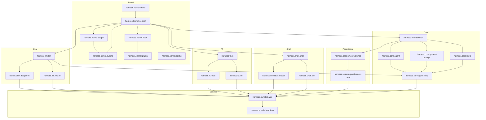

# 02 · 模块布局（JPMS）

## 1. 模块命名约定

| 层级 | 命名模式 | 示例 |
|---|---|---|
| Kernel | `io.deepseek.harness.kernel[.<sub>]` | `io.deepseek.harness.kernel.context` |
| Core | `io.deepseek.harness.core.<pkg>` | `io.deepseek.harness.core.session` |
| Capability | `io.deepseek.harness.<cap>[.<pkg>]` | `io.deepseek.harness.fs`, `io.deepseek.harness.fs.local` |
| Bundle | `io.deepseek.harness.bundle.<name>` | `io.deepseek.harness.bundle.base` |
| Examples | `io.deepseek.harness.examples.<name>` | `io.deepseek.harness.examples.agent_spine` |

缩写：代码中 import 用 `io.dsh.*`（通过 `module-info.java` 的 `exports`）。

JPMS 模块名用完整 `io.deepseek.harness.*`，Maven coordinates 用 `io.deepseek:harness-<group>-<pkg>:<version>`，artifactId 全程小写连字符（如 `harness-kernel-context`）。

## 2. 完整模块清单

### Kernel 层（框架内核，零业务依赖）

| 模块 | 依赖 | 职责 |
|---|---|---|
| `harness.kernel.brand` | （无）| `Id<T>` phantom type（对应 dsh-brand） |
| `harness.kernel.context` | `brand` | `ServiceKey`、`Context`、`ServiceRegistry`、`Subscription` |
| `harness.kernel.fiber` | `context` | `Fiber`、`FiberRuntime`（生命周期容器） |
| `harness.kernel.events` | `context`, `scope` | `Events`、`EventKey`、`EventListener`、`WaterfallArgs` |
| `harness.kernel.scope` | `context`, `fiber` | `ScopeKey`、`ScopedLayers<L>`、`Scope`（工具类） |
| `harness.kernel.plugin` | `context`, `fiber` | `Plugin` 接口、`PluginLoader`（ServiceLoader） |
| `harness.kernel.config` | （无）| YAML 配置 record + 构造器白名单 |
| `harness.kernel` | 上述全部 | 聚合模块，`exports` 所有 kernel API |

> **为什么 kernel 拆这么多子模块？** JPMS 的 `requires` 是传递的，消费者只需 `requires io.deepseek.harness.kernel` 即可拿到全部。但**模块内部循环依赖**必须靠拆分打破：`scope` 和 `events` 都依赖 `context`，`events` 又依赖 `scope`（过滤用），三者不能在一个模块里循环。

### Core 层（Agent 主干）

| 模块 | 依赖 | 职责 | dsh 对应 |
|---|---|---|---|
| `harness.core.session` | `kernel` | `Session`（事件日志）、`SessionEvent` 类型体系、`SessionStore` | `core/session` |
| `harness.core.system-prompt` | `kernel`, `session` | `SystemPrompt` 组装注册表 | `core/system-prompt` |
| `harness.core.tools` | `kernel`, `session` | `ToolRegistry`、`ToolDefinition`、执行 pipeline | `core/tools` |
| `harness.core.agent` | `kernel`, `session` | `Agent` 接口、`AgentRegistry`、`agent/*` 事件 | `core/agent` |
| `harness.core.agent-loop` | `agent`, `tools`, `system-prompt`, `llm` | 具体驱动实现 | `core/agent-loop` |
| `harness.core` | 上述全部 | 聚合 | `core` |

### Capability 层（可替换 seam）

每个 seam 是 **Definition + Provider(s) + Consumer** 三个模块：

#### LLM（模型适配器）

| 模块 | 角色 | 职责 |
|---|---|---|
| `harness.llm.llm` | Definition | `LlmService`、`Message`/`ContentBlock`/`StreamChunk` 类型、`LlmAdapter` 接口 |
| `harness.llm.deepseek` | Provider | DeepSeek API 适配器 |
| `harness.llm.replay` | Provider | 回放适配器（测试用） |

#### FS（文件系统）

| 模块 | 角色 | 职责 |
|---|---|---|
| `harness.fs.fs` | Definition | `FsService` 接口（read/write/edit/delete） |
| `harness.fs.local` | Provider | 本地文件系统实现 |
| `harness.fs.tool` | Consumer | `fs_read`/`fs_write`/`fs_edit` 工具 |

#### Shell（命令执行）

| 模块 | 角色 | 职责 |
|---|---|---|
| `harness.shell.shell` | Definition | `ShellExecutor` 接口 |
| `harness.shell.bash-local` | Provider | 本地 bash 实现 |
| `harness.shell.tool` | Consumer | `bash` 工具 |

#### Sandbox（沙箱）

| 模块 | 角色 | 职责 |
|---|---|---|
| `harness.sandbox.sandbox` | Definition | `SandboxProvider` 接口（wrap argv） |
| `harness.sandbox.local` | Provider | 本地进程包装（可选 Landlock/JVM SecurityManager） |

#### Session Persistence（会话持久化）

| 模块 | 角色 | 职责 |
|---|---|---|
| `harness.session.persistence` | Definition | `SessionPersistence` 接口 |
| `harness.session.persistence-jsonl` | Provider | JSONL 后端 |

> MVP 只做 JSONL，不做 SQLite。接口预留。

#### Interaction（交互/审批）

| 模块 | 角色 | 职责 |
|---|---|---|
| `harness.interaction.approval` | Definition | `ApprovalService` 接口 |
| `harness.interaction.commands` | Definition | `CommandRegistry`（slash 命令） |

> MVP approval 给一个 `AutoApprove` / `AlwaysDeny` stub。

### Bundle 层（组合发行）

| 模块 | 职责 | dsh 对应 |
|---|---|---|
| `harness.bundle.base` | 首层 bundle：挂载 model adapter + tools + persistence + sandbox + approval | `dsh-base` |
| `harness.bundle.headless` | 一次性 runner（无 server） | `dsh-headless` |

### Examples（可运行示例）

| 模块 | 职责 |
|---|---|
| `harness.examples.agent-spine` | 最小 agent 主干 demo（6 包 loop 跑通） |
| `harness.examples.headless` | `java -jar ... "task"` 命令行 runner |

## 3. 依赖图



## 4. module-info.java 示例

### kernel.context

```java
module io.deepseek.harness.kernel.context {
    requires io.deepseek.harness.kernel.brand;
    requires org.jspecify;                  // nullness 注解
    requires java.util.concurrent;          // ConcurrentHashMap 等

    exports io.dsh.kernel.context;
}
```

### core.session

```java
module io.deepseek.harness.core.session {
    requires io.deepseek.harness.kernel;
    requires com.fasterxml.jackson.databind;  // JSON 校验/序列化边界

    exports io.dsh.core.session;
    exports io.dsh.core.session.event;
    exports io.dsh.core.session.surface;

    // 允许反射访问 SessionEvent 子类（provider 可扩展事件类型）
    opens io.dsh.core.session.event to
        com.fasterxml.jackson.databind;
}
```

### llm.deepseek（Provider）

```java
module io.deepseek.harness.llm.deepseek {
    requires io.deepseek.harness.llm.llm;
    requires io.deepseek.harness.kernel;
    requires java.net.http;                 // HttpClient
    requires com.fasterxml.jackson.databind;

    provides io.dsh.kernel.plugin.Plugin
        with io.dsh.llm.deepseek.DeepSeekPlugin;
}
```

### bundle.base

```java
module io.deepseek.harness.bundle.base {
    requires io.deepseek.harness.core;
    requires io.deepseek.harness.llm.deepseek;
    requires io.deepseek.harness.llm.replay;
    requires io.deepseek.harness.fs.local;
    requires io.deepseek.harness.fs.tool;
    requires io.deepseek.harness.shell.bash.local;
    requires io.deepseek.harness.shell.tool;
    requires io.deepseek.harness.session.persistence.jsonl;

    // bundle 不 export API，只提供 Plugin
    provides io.dsh.kernel.plugin.Plugin
        with io.dsh.bundle.base.BaseBundlePlugin;
}
```

## 5. Maven 构建结构

多模块 Maven reactor。父 POM 集中声明版本、插件配置、JPMS 开关；每个子模块一个最小 `pom.xml`。

### 为什么 Maven 而非 Gradle

| 维度 | Maven | Gradle |
|---|---|---|
| JPMS 支持 | compiler 3.10+ 原生识别 `module-info.java` | 需 `modularity.inferModulePath=true`，部分场景需 extra 插件 |
| 多模块依赖图可读性 | `dependency:tree` + 父 POM `dependencyManagement` 直观 | `dependencies` task，配置更灵活但也更隐晦 |
| IDE 支持 | IntelliJ/Eclipse/VSCode 一等公民，零配置导入 | 需 Gradle 插件，首次导入慢 |
| 学习曲线 | XML 声明式，约定大于配置 | Groovy/Kotlin DSL，灵活但门槛高 |
| 企业 CI 兼容 | 几乎所有 CI 模板默认 Maven | 需额外 wrapper 配置 |
| 本项目需求 | 多模块 + JPMS + SPI，Maven 完全够用 | Gradle 的增量编译/构建缓存对本项目收益有限 |

本项目模块多（30+）但每模块小、依赖关系清晰、无复杂构建逻辑（无 codegen 任务、无多产物变体），Maven 的声明式 POM + 父子继承最匹配。Gradle 的优势（增量编译、构建缓存、Kotlin DSL 灵活性）在这个"框架库"场景收益不大，反而增加配置复杂度。

### 目录布局

```
harness/
├── pom.xml                          ← 父 POM（packaging=pom，聚合 + 公共配置）
├── kernel/
│   ├── pom.xml                      ← 聚合（packaging=pom，列 <modules>）
│   ├── brand/pom.xml
│   ├── context/pom.xml
│   ├── fiber/pom.xml
│   ├── scope/pom.xml
│   ├── events/pom.xml
│   ├── plugin/pom.xml
│   └── config/pom.xml
├── core/
│   ├── pom.xml                      ← 聚合
│   ├── session/pom.xml
│   ├── system-prompt/pom.xml
│   ├── tools/pom.xml
│   ├── agent/pom.xml
│   └── agent-loop/pom.xml
├── llm/
│   ├── pom.xml                      ← 聚合
│   ├── llm/pom.xml
│   ├── deepseek/pom.xml
│   └── replay/pom.xml
├── fs/
│   ├── pom.xml
│   ├── fs/pom.xml
│   ├── local/pom.xml
│   └── tool/pom.xml
├── shell/...
├── session/...
├── bundle/
│   ├── pom.xml
│   ├── base/pom.xml
│   └── headless/pom.xml
└── examples/
    ├── pom.xml
    ├── agent-spine/pom.xml
    └── headless/pom.xml
```

### 父 POM（根 `harness/pom.xml`）

```xml
<?xml version="1.0" encoding="UTF-8"?>
<project xmlns="http://maven.apache.org/POM/4.0.0"
         xmlns:xsi="http://www.w3.org/2001/XMLSchema-instance"
         xsi:schemaLocation="http://maven.apache.org/POM/4.0.0
                             https://maven.apache.org/xsd/maven-4.0.0.xsd">
    <modelVersion>4.0.0</modelVersion>

    <groupId>io.deepseek</groupId>
    <artifactId>harness-parent</artifactId>
    <version>0.1.0-SNAPSHOT</version>
    <packaging>pom</packaging>

    <name>DeepSeek Harness (JH)</name>

    <properties>
        <maven.compiler.release>25</maven.compiler.release>
        <project.build.sourceEncoding>UTF-8</project.build.sourceEncoding>

        <!-- 用 BOM 集中管第三方版本，避免每个子模块散落版本号 -->
        <jackson.version>2.17.0</jackson.version>
        <snakeyaml.version>2.2</snakeyaml.version>
        <junit.version>5.10.2</junit.version>
        <assertj.version>3.25.3</assertj.version>
        <jacoco.version>0.8.12</jacoco.version>
    </properties>

    <!-- 聚合：列出所有一级子聚合模块 -->
    <modules>
        <module>kernel</module>
        <module>core</module>
        <module>llm</module>
        <module>fs</module>
        <module>shell</module>
        <module>session</module>
        <module>sandbox</module>
        <module>interaction</module>
        <module>bundle</module>
        <module>examples</module>
    </modules>

    <dependencyManagement>
        <dependencies>
            <!-- 第三方 BOM -->
            <dependency>
                <groupId>com.fasterxml.jackson</groupId>
                <artifactId>jackson-bom</artifactId>
                <version>${jackson.version}</version>
                <type>pom</type>
                <scope>import</scope>
            </dependency>
            <dependency>
                <groupId>org.junit</groupId>
                <artifactId>junit-bom</artifactId>
                <version>${junit.version}</version>
                <type>pom</type>
                <scope>import</scope>
            </dependency>

            <!-- 第三方单 artifact -->
            <dependency>
                <groupId>org.yaml</groupId>
                <artifactId>snakeyaml</artifactId>
                <version>${snakeyaml.version}</version>
            </dependency>
            <dependency>
                <groupId>org.assertj</groupId>
                <artifactId>assertj-core</artifactId>
                <version>${assertj.version}</version>
                <scope>test</scope>
            </dependency>

            <!-- 内部模块：在此集中声明 GAV，子模块引用时不写 version -->
            <dependency>
                <groupId>io.deepseek</groupId>
                <artifactId>harness-kernel-context</artifactId>
                <version>${project.version}</version>
            </dependency>
            <dependency>
                <groupId>io.deepseek</groupId>
                <artifactId>harness-kernel-brand</artifactId>
                <version>${project.version}</version>
            </dependency>
            <dependency>
                <groupId>io.deepseek</groupId>
                <artifactId>harness-kernel-fiber</artifactId>
                <version>${project.version}</version>
            </dependency>
            <dependency>
                <groupId>io.deepseek</groupId>
                <artifactId>harness-kernel-scope</artifactId>
                <version>${project.version}</version>
            </dependency>
            <dependency>
                <groupId>io.deepseek</groupId>
                <artifactId>harness-kernel-events</artifactId>
                <version>${project.version}</version>
            </dependency>
            <dependency>
                <groupId>io.deepseek</groupId>
                <artifactId>harness-kernel-plugin</artifactId>
                <version>${project.version}</version>
            </dependency>
            <dependency>
                <groupId>io.deepseek</groupId>
                <artifactId>harness-core-session</artifactId>
                <version>${project.version}</version>
            </dependency>
            <dependency>
                <groupId>io.deepseek</groupId>
                <artifactId>harness-core-tools</artifactId>
                <version>${project.version}</version>
            </dependency>
            <dependency>
                <groupId>io.deepseek</groupId>
                <artifactId>harness-core-agent</artifactId>
                <version>${project.version}</version>
            </dependency>
            <dependency>
                <groupId>io.deepseek</groupId>
                <artifactId>harness-llm-llm</artifactId>
                <version>${project.version}</version>
            </dependency>
            <dependency>
                <groupId>io.deepseek</groupId>
                <artifactId>harness-fs-fs</artifactId>
                <version>${project.version}</version>
            </dependency>
            <dependency>
                <groupId>io.deepseek</groupId>
                <artifactId>harness-shell-shell</artifactId>
                <version>${project.version}</version>
            </dependency>
            <!-- ... 其余内部模块同理 ... -->
        </dependencies>
    </dependencyManagement>

    <build>
        <pluginManagement>
            <plugins>
                <plugin>
                    <artifactId>maven-compiler-plugin</artifactId>
                    <version>3.13.0</version>
                    <configuration>
                        <release>25</release>
                        <!--
                          开启 JPMS：Maven 3.6+ + compiler 3.10+ 自动识别
                          src/main/java/module-info.java，无需额外配置。
                          它会把 module-path 设为所有 dependencies。

                          若使用 preview 特性（如 JEP 505 StructuredConcurrency），
                          额外加 <enablePreview>true</enablePreview> 并确保
                          --enable-preview 在 surefire/exec 的 argLine 里。
                          本设计仅隔离在少数类用 preview，默认不开。
                        -->
                        <compilerArgs>
                            <arg>-Xlint:all</arg>
                            <arg>-Werror</arg>  <!-- 警告即错误，对应 dsh fail loud -->
                        </compilerArgs>
                    </configuration>
                </plugin>

                <plugin>
                    <artifactId>maven-surefire-plugin</artifactId>
                    <version>3.2.5</version>
                    <configuration>
                        <!-- JPMS 下测试也需要 module-path；
                             surefire 自动处理，但 opens 测试包需要下方的配置 -->
                        <argLine>
                            --add-opens io.deepseek.harness.core.session/io.dsh.core.session=ALL-UNNAMED
                        </argLine>
                    </configuration>
                </plugin>

                <!-- 覆盖率（可选）-->
                <plugin>
                    <groupId>org.jacoco</groupId>
                    <artifactId>jacoco-maven-plugin</artifactId>
                    <version>${jacoco.version}</version>
                </plugin>
            </plugins>
        </pluginManagement>

        <!-- 所有子模块继承的测试依赖 -->
        <dependencies>
            <dependency>
                <groupId>org.junit.jupiter</groupId>
                <artifactId>junit-jupiter</artifactId>
                <scope>test</scope>
            </dependency>
            <dependency>
                <groupId>org.assertj</groupId>
                <artifactId>assertj-core</artifactId>
                <scope>test</scope>
            </dependency>
        </dependencies>
    </build>
</project>
```

### 聚合 POM（如 `kernel/pom.xml`，packaging=pom）

```xml
<?xml version="1.0" encoding="UTF-8"?>
<project xmlns="http://maven.apache.org/POM/4.0.0"
         xmlns:xsi="http://www.w3.org/2001/XMLSchema-instance"
         xsi:schemaLocation="http://maven.apache.org/POM/4.0.0
                             https://maven.apache.org/xsd/maven-4.0.0.xsd">
    <modelVersion>4.0.0</modelVersion>

    <parent>
        <groupId>io.deepseek</groupId>
        <artifactId>harness-parent</artifactId>
        <version>0.1.0-SNAPSHOT</version>
        <!-- parent 的 relativePath 默认指向上一级 -->
    </parent>

    <artifactId>harness-kernel-aggregator</artifactId>
    <packaging>pom</packaging>

    <modules>
        <module>brand</module>
        <module>context</module>
        <module>fiber</module>
        <module>scope</module>
        <module>events</module>
        <module>plugin</module>
        <module>config</module>
    </modules>
</project>
```

### 叶子模块 POM（如 `kernel/context/pom.xml`）

```xml
<?xml version="1.0" encoding="UTF-8"?>
<project xmlns="http://maven.apache.org/POM/4.0.0"
         xmlns:xsi="http://www.w3.org/2001/XMLSchema-instance"
         xsi:schemaLocation="http://maven.apache.org/POM/4.0.0
                             https://maven.apache.org/xsd/maven-4.0.0.xsd">
    <modelVersion>4.0.0</modelVersion>

    <parent>
        <groupId>io.deepseek</groupId>
        <artifactId>harness-kernel-aggregator</artifactId>
        <version>0.1.0-SNAPSHOT</version>
    </parent>

    <artifactId>harness-kernel-context</artifactId>

    <dependencies>
        <!-- 内部模块：不写 version（由父 POM dependencyManagement 提供）-->
        <dependency>
            <groupId>io.deepseek</groupId>
            <artifactId>harness-kernel-brand</artifactId>
        </dependency>

        <!-- 第三方：版本由 jackson-bom / junit-bom 提供 -->
        <dependency>
            <groupId>org.jspecify</groupId>
            <artifactId>jspecify</artifactId>
            <version>1.0.0</version>
        </dependency>
    </dependencies>
</project>
```

### Provider 模块 POM（如 `llm/deepseek/pom.xml`）—— SPI 关键

```xml
<project>
    <parent>
        <groupId>io.deepseek</groupId>
        <artifactId>harness-llm-aggregator</artifactId>
        <version>0.1.0-SNAPSHOT</version>
    </parent>

    <artifactId>harness-llm-deepseek</artifactId>

    <dependencies>
        <!-- 只依赖 Definition，不依赖其他 Provider -->
        <dependency>
            <groupId>io.deepseek</groupId>
            <artifactId>harness-llm-llm</artifactId>
        </dependency>
        <dependency>
            <groupId>io.deepseek</groupId>
            <artifactId>harness-kernel-context</artifactId>
        </dependency>
        <dependency>
            <groupId>io.deepseek</groupId>
            <artifactId>harness-credentials-credentials</artifactId>
        </dependency>
    </dependencies>

    <build>
        <plugins>
            <!--
              关键：让 consumer 模块编译时检查不到 provider，运行时通过
              ServiceLoader 发现。Maven 自动处理 module-info.java 的
              provides/with 声明（生成 META-INF/services）。
            -->
        </plugins>
    </build>
</project>
```

### Consumer 模块 POM（如 `fs/tool/pom.xml`）—— 隔离关键

```xml
<project>
    <parent>
        <groupId>io.deepseek</groupId>
        <artifactId>harness-fs-aggregator</artifactId>
        <version>0.1.0-SNAPSHOT</version>
    </parent>

    <artifactId>harness-fs-tool</artifactId>

    <dependencies>
        <!-- ✅ 只依赖 Definition + 工具注册表 -->
        <dependency>
            <groupId>io.deepseek</groupId>
            <artifactId>harness-fs-fs</artifactId>
        </dependency>
        <dependency>
            <groupId>io.deepseek</groupId>
            <artifactId>harness-core-tools</artifactId>
        </dependency>
        <!-- ❌ 注意：不依赖 harness-fs-local（Provider）！
                module-info.java 没有 requires，
                pom.xml 也没有 <dependency>。
                双重保障（JPMS 编译期 + Maven 依赖图）。-->
    </dependencies>
</project>
```

### headless 可执行 jar（`examples/headless/pom.xml`）

```xml
<project>
    <parent>
        <groupId>io.deepseek</groupId>
        <artifactId>harness-examples-aggregator</artifactId>
        <version>0.1.0-SNAPSHOT</version>
    </parent>

    <artifactId>harness-examples-headless</artifactId>

    <dependencies>
        <dependency>
            <groupId>io.deepseek</groupId>
            <artifactId>harness-bundle-base</artifactId>
        </dependency>
    </dependencies>

    <build>
        <finalName>jh</finalName>
        <plugins>
            <!-- 打可执行 fat jar：把所有 provider 一起打进 classpath -->
            <plugin>
                <artifactId>maven-shade-plugin</artifactId>
                <version>3.5.2</version>
                <executions>
                    <execution>
                        <phase>package</phase>
                        <goals><goal>shade</goal></goals>
                        <configuration>
                            <transformers>
                                <transformer implementation="org.apache.maven.plugins.shade.resource.ManifestResourceTransformer">
                                    <mainClass>io.dsh.headless.HeadlessMain</mainClass>
                                </transformer>
                                <!--
                                  合并所有 SPI 描述文件（ServiceLoader 发现关键）。
                                  shade 默认用 ServicesResourceTransformer 合并
                                  META-INF/services，但 JPMS 下 provider 声明在
                                  module-info.java 的 provides 里——shade 会处理。
                                -->
                                <transformer implementation="org.apache.maven.plugins.shade.resource.ServicesResourceTransformer"/>
                            </transformers>
                        </configuration>
                    </execution>
                </executions>
            </plugin>
        </plugins>
    </build>
</project>
```

### 常用命令

```sh
mvn clean install                  # 全量构建 + 安装到本地仓库
mvn -pl :harness-core-session test # 只测一个模块（按 artifactId 过滤）
mvn -pl :harness-examples-headless -am package  # 只打 headless 及其依赖
mvn dependency:tree                # 查看某模块的依赖树（验证 Consumer 未拉入 Provider）
mvn -q exec:java -Dexec.mainClass=io.dsh.headless.HeadlessMain --args="--profile headless --dump-config"
```

`-am`（also-make）会自动构建被依赖的模块；`-pl`（projects）按 `:artifactId` 选中。

## 6. dsh → JH 模块映射对照

| dsh 包 | JH 模块 | 状态 |
|---|---|---|
| `@deepseek-ai/dsh-brand` | `kernel.brand` | ✅ |
| Cordis `vendor/cordis` | `kernel.{context,fiber,events,scope,plugin,config}` | ✅ 拆分 |
| `core/session` | `core.session` | ✅ |
| `core/system-prompt` | `core.system-prompt` | ✅ |
| `core/tools` | `core.tools` | ✅ |
| `core/agent` | `core.agent` | ✅ |
| `core/agent-loop` | `core.agent-loop` | ✅ |
| `core/scope` | `kernel.scope`（降级到 kernel） | ✅ |
| `llm/llm` | `llm.llm` | ✅ |
| `llm/llm-deepseek` | `llm.deepseek` | ✅ |
| `llm/llm-replay` | `llm.replay` | ✅ |
| `fs/fs` + `fs/fs-local` | `fs.fs` + `fs.local` | ✅ |
| `fs/tool-fs` | `fs.tool` | ✅ |
| `shell/shell` + `shell/bash-local` | `shell.shell` + `shell.bash-local` | ✅ |
| `shell/tool-bash` | `shell.tool` | ✅ |
| `sandbox/sandbox` + `sandbox/sandbox-local` | `sandbox.sandbox` + `sandbox.local` | ✅（简化）|
| `session/session-persistence` + `-jsonl` | `session.persistence` + `persistence-jsonl` | ✅（JSONL only）|
| `interaction/approval` | `interaction.approval` | ✅（stub）|
| `bundle/base` | `bundle.base` | ✅ |
| `bundle/headless` | `bundle.headless` | ✅ |
| `core/agent-default-model` | （合并进 agent-loop） | ✅ 简化 |
| `e2b/*` | — | ❌ 不做 |
| `web/*` | — | ❌ 不做 |
| `lsp/*` | — | ❌ 不做 |
| `subagent/*` | — | ❌ 留接口 |
| `workflow/*` | — | ❌ 留接口 |
| `hooks/*` | — | ❌ 不做 |
| `acp` | — | ❌ 不做 |
| `python/`, `native/` | — | N/A |

## 7. 模块边界纪律（移植 dsh 约定）

1. **Source plane vs Artifact plane**：Maven 的 `src/main/java` 是源码平面，`target/*.jar` 是产物平面。测试通过 JPMS `--module-path` 跑源码平面，发布用 jar 产物。**不混用**。

2. **每个模块一个 `module-info.java`**（aggregate 模块除外，它只有 `requires` + `exports` re-export）。不允许 `requires transitive` 跨界传染依赖。

3. **`opens` 仅给 JSON 反射**（Jackson）和测试框架。不 `opens` 业务包。

4. **Capability seam 三模块纪律**：Definition 模块 `exports` 接口；Provider 模块 `provides Plugin`；Consumer 模块 `requires` Definition。三者绝不循环。

5. **Plugin 注册即效应**：所有 `provide`/`on` 都在 `Plugin.apply(ctx)` 内通过 `ctx` 执行，返回的 `Subscription` 由 fiber 栈兜底。**不允许 Plugin 持有全局静态状态**。
